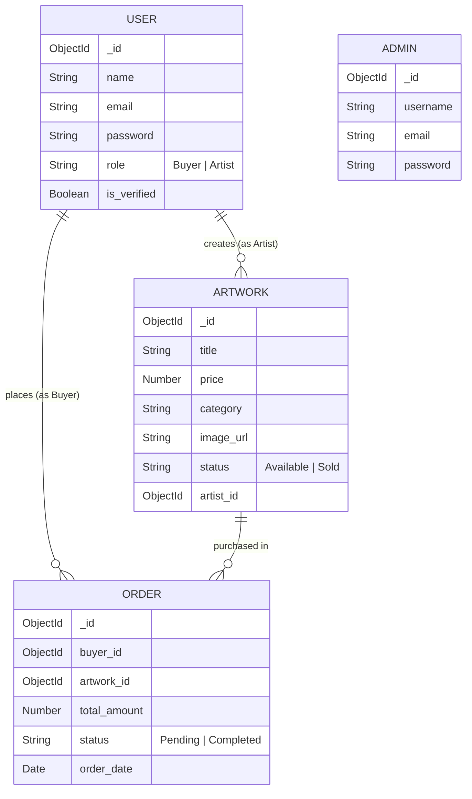

# M-Art — Project Flow & Code Architecture

## 📁 Project Structure

```
m-art/
├── index.html                  # Entry HTML
├── vite.config.js              # Vite + API proxy config
├── tailwind.config.js          # Tailwind custom colors
├── src/                        # Frontend (React)
│   ├── main.jsx                # App entry — wraps with Router, Auth, Cart
│   ├── App.jsx                 # Route definitions
│   ├── index.css               # Global styles + animations
│   ├── utils/
│   │   └── api.js              # Axios instance with JWT interceptor
│   ├── context/
│   │   ├── AuthContext.jsx     # Auth state (login, register, logout)
│   │   └── CartContext.jsx     # Cart state (add, remove, persist)
│   ├── components/
│   │   ├── Navbar.jsx          # Public nav bar
│   │   ├── ProtectedRoute.jsx  # Role-based route guard
│   │   ├── Sidebar.jsx         # Admin sidebar navigation
│   │   ├── Overview.jsx        # Admin dashboard stats
│   │   ├── VerifyArtists.jsx   # Admin: approve/reject artists
│   │   ├── ArtworkModeration.jsx # Admin: manage artworks
│   │   └── Transactions.jsx    # Admin: view orders
│   └── pages/
│       ├── Home.jsx            # Landing page
│       ├── Gallery.jsx         # Public art gallery (search + filters)
│       ├── ArtworkDetail.jsx   # Single artwork view
│       ├── Login.jsx           # User + Admin login
│       ├── Register.jsx        # Buyer / Artist registration
│       ├── Cart.jsx            # Shopping cart
│       ├── Checkout.jsx        # Checkout simulation
│       ├── ArtistDashboard.jsx # Artist: upload & manage art
│       └── AdminLayout.jsx     # Admin panel wrapper
└── server/                     # Backend (Express + MongoDB)
    ├── .env                    # MONGO_URI, PORT, JWT_SECRET
    ├── server.js               # Express app — mounts routes
    ├── seed.js                 # Database seeder with test data
    ├── config/
    │   └── db.js               # MongoDB connection
    ├── middleware/
    │   └── auth.js             # JWT verify + role guard
    ├── models/
    │   ├── User.js             # name, email, password, role, is_verified
    │   ├── Admin.js            # username, email, password
    │   ├── Artwork.js          # title, price, category, image_url, status, artist_id
    │   └── Order.js            # buyer_id, artwork_id, total_amount, status
    └── routes/
        ├── auth.js             # Register, Login, Admin Login, Get Me
        ├── artworks.js         # CRUD (public GET filters by verified artist)
        ├── orders.js           # Create order, list orders
        └── users.js            # Admin: list users, verify/reject, stats
```

---

## 🔄 Application Flow

### 1. App Startup

```
main.jsx
  └─ BrowserRouter
       └─ AuthProvider          ← reads JWT from localStorage
            └─ CartProvider     ← reads cart from localStorage
                 └─ App.jsx     ← defines all routes
```

### 2. Routing (App.jsx)

| Path | Component | Access |
|------|-----------|--------|
| `/` | Home | Public |
| `/gallery` | Gallery | Public |
| `/gallery/:id` | ArtworkDetail | Public |
| `/login` | Login | Public |
| `/register` | Register | Public |
| `/cart` | Cart | Public |
| `/checkout` | Checkout | Buyer only |
| `/artist/dashboard` | ArtistDashboard | Artist only |
| `/admin/*` | AdminLayout | Admin only |

`ProtectedRoute` checks `AuthContext` → redirects to `/login` if not authenticated or wrong role.

---

## 🔐 Authentication Flow

```
┌──────────┐     POST /api/auth/register     ┌──────────┐
│  Client   │ ──────────────────────────────→ │  Server  │
│ (React)   │     { name, email, password,   │ (Express)│
│           │       role: "Buyer"/"Artist" }  │          │
│           │ ←────────────────────────────── │          │
│           │     { user data + JWT token }   │          │
└──────────┘                                  └──────────┘

1. Password hashed with bcryptjs (salt rounds: 10)
2. JWT signed with JWT_SECRET, expires in 7 days
3. Token stored in localStorage as 'mart_token'
4. Axios interceptor attaches: Authorization: Bearer <token>
```

### Role Behavior

| Role | is_verified | What They Can Do |
|------|-------------|------------------|
| **Buyer** | always `true` | Browse gallery, add to cart, checkout, view orders |
| **Artist** | `false` initially | Upload artworks, manage inventory, view sales |
| **Artist** | `true` (admin approved) | Same as above + artworks visible in public gallery |
| **Admin** | — (separate model) | Dashboard stats, verify artists, moderate artworks, view all orders |

---

## 🎨 Gallery & Artwork Flow

```
Gallery.jsx
  │
  ├─ GET /api/artworks?category=X&minPrice=Y&maxPrice=Z&search=Q
  │   │
  │   └─ Backend (routes/artworks.js):
  │       1. Find all Users where role="Artist" AND is_verified=true
  │       2. Filter Artworks where artist_id IN verified_ids
  │       3. Apply category, price, search filters
  │       4. Return results (populated with artist name/email)
  │
  └─ Renders ArtCard components
      └─ GSAP 3D tilt effect on mouse move (rotateX/rotateY)
```

> **Key Logic**: Unverified artists' artworks are **never returned** by the public API.

---

## 🛒 Shopping Cart & Checkout Flow

```
1. User clicks "+ Cart" on ArtCard
      │
      ▼
2. CartContext.addToCart(artwork)
   → Saves to state + localStorage
      │
      ▼
3. /cart page shows items + total
   → "Proceed to Checkout"
      │
      ▼
4. /checkout page
   → User clicks "Place Order"
      │
      ▼
5. POST /api/orders  { items: [{ artwork_id }] }
   │
   └─ Backend:
      ├─ Creates Order record (status: "Completed")
      ├─ Marks Artwork.status = "Sold"
      └─ Returns success
      │
      ▼
6. Success page → Cart cleared
```

---

## 👨‍🎨 Artist Dashboard Flow

```
ArtistDashboard.jsx
  │
  ├─ GET /api/artworks/artist/me    → Artist's own artworks
  ├─ GET /api/orders/artist         → Sales of their artworks
  │
  ├─ POST /api/artworks             → Upload new artwork
  ├─ PUT /api/artworks/:id          → Edit own artwork
  └─ DELETE /api/artworks/:id       → Delete own artwork

Note: Artist must own the artwork to edit/delete (server-side check)
```

---

## 🛡️ Admin Panel Flow

```
AdminLayout.jsx (route: /admin)
  │
  ├─ Overview.jsx
  │   ├─ GET /api/users/stats       → { totalUsers, totalArtists, pendingVerifications }
  │   └─ GET /api/orders             → Recent orders + revenue calc
  │
  ├─ VerifyArtists.jsx
  │   ├─ GET /api/users/unverified-artists  → Pending artists
  │   ├─ PUT /api/users/:id/verify          → Approve (is_verified = true)
  │   └─ PUT /api/users/:id/reject          → Reject (deletes user)
  │
  ├─ ArtworkModeration.jsx
  │   ├─ GET /api/artworks/all              → ALL artworks (admin only)
  │   └─ DELETE /api/artworks/:id           → Remove listing
  │
  └─ Transactions.jsx
      └─ GET /api/orders                    → All orders with filters
```

---

## 🗄️ Database Schema (ERD)



---

## 🔑 API Endpoints Summary

### Auth (`/api/auth`)
| Method | Endpoint | Auth | Description |
|--------|----------|------|-------------|
| POST | `/register` | ✗ | Register buyer/artist |
| POST | `/login` | ✗ | User login → JWT |
| POST | `/admin/login` | ✗ | Admin login → JWT |
| GET | `/me` | ✓ | Get current user |

### Artworks (`/api/artworks`)
| Method | Endpoint | Auth | Description |
|--------|----------|------|-------------|
| GET | `/` | ✗ | Public gallery (verified only) |
| GET | `/artist/me` | Artist | My artworks |
| GET | `/all` | Admin | All artworks |
| GET | `/:id` | ✗ | Single artwork |
| POST | `/` | Artist | Create artwork |
| PUT | `/:id` | Artist | Update own artwork |
| DELETE | `/:id` | Artist/Admin | Delete artwork |

### Orders (`/api/orders`)
| Method | Endpoint | Auth | Description |
|--------|----------|------|-------------|
| POST | `/` | Buyer | Place order (checkout) |
| GET | `/my` | Buyer | My orders |
| GET | `/artist` | Artist | My sales |
| GET | `/` | Admin | All orders |

### Users (`/api/users`)
| Method | Endpoint | Auth | Description |
|--------|----------|------|-------------|
| GET | `/` | Admin | All users |
| GET | `/unverified-artists` | Admin | Pending artists |
| GET | `/stats` | Admin | Dashboard stats |
| PUT | `/:id/verify` | Admin | Approve artist |
| PUT | `/:id/reject` | Admin | Reject + delete artist |

---

## 🚀 Quick Start

```bash
# Terminal 1 — Seed & start backend
cd server
node seed.js
node server.js

# Terminal 2 — Start frontend
npm run dev
```

**Frontend**: http://localhost:5173  
**Backend API**: http://localhost:5000
